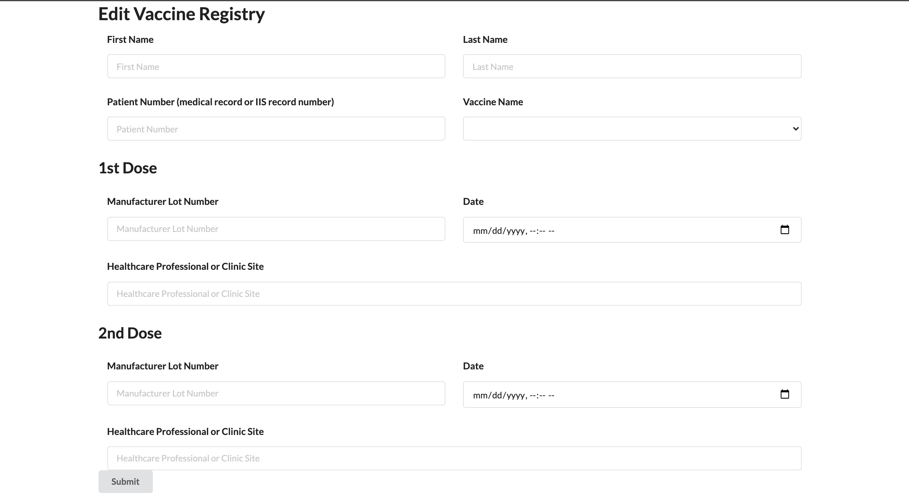
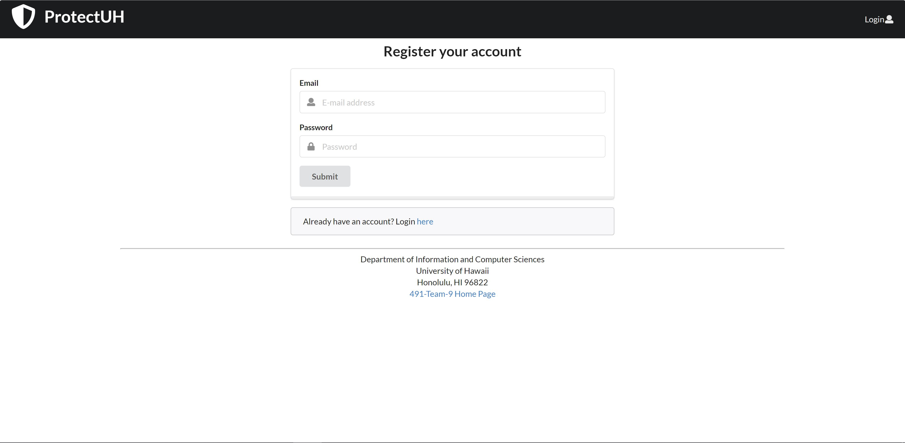

# Team 09 - Assignment 1

This is a simple Covid tracking application that allows users to specify for the current day, whether or not they are experiencing Covid symptoms.

You can find the site [here](https://491-team-9.meteorapp.com/#/).  
The source code can be found [here](https://github.com/491-Team-9/covid-application).

---

## Team members

- Joshua Hartmann
- Keith Okuna
- Liam Herman
- Louella Caraang
- Sydney Chun

---

## Landing Page
This page will be shown when a user visits the site.

---

## Home Page
This page is shown once a user signs in.

---

## Check in Page
This page allows a user to specify their covid status for the day, which can be done multiple times a day.

---

## Vaccine Page
This page allows a user to enter their vaccine shot information.

---

## Check in History Page
This page allows a user to see their check in history.

---

## Sign in Page
This page allows users to sign in, to be able to use the application.

---

## Sign up Page
This page allows a new user to create an account.

---

## Sign out Page
This page is shown once a user signs out.

